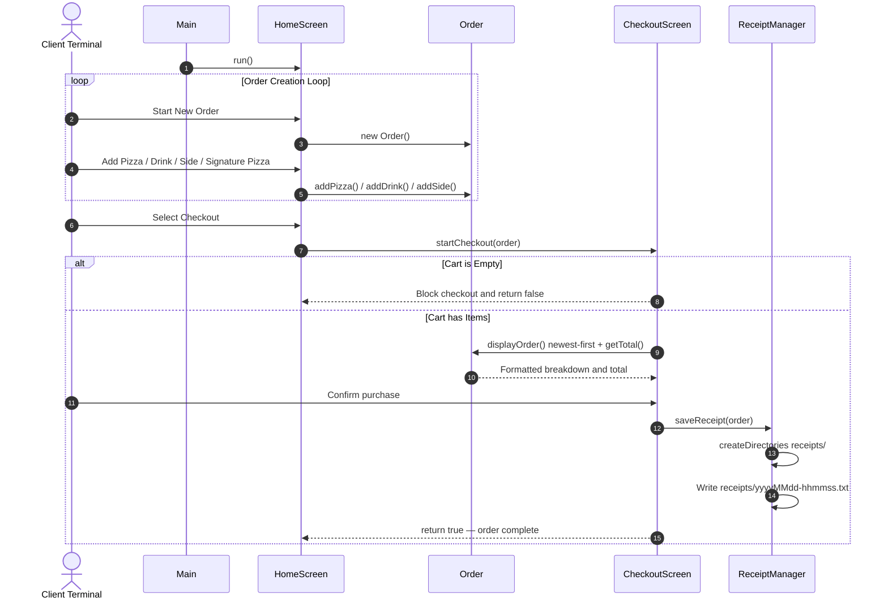

# PIZZA-licious
### A terminal-based pizza ordering system built in Java with customizable orders, receipt generation, and structured checkout flow.
[](#)
[](#)
[](#)
[](#)
---
## 🗺️ System Overview
### Project Description
PIZZA-licious is a Java-based command-line ordering system for a pizza shop. It allows users to build fully custom pizzas, select pre-configured signature pizzas, add drinks and sides, and complete checkout with an automatically generated receipt file.
The system replaces manual order tracking with a structured digital workflow that ensures accurate pricing and consistent order handling.
### Problem Solved & Target User
This application replaces a manual paper-based ordering process that was prone to calculation mistakes and missing records. It ensures:
- Accurate order totals through automated polymorphic pricing dispatch
- Organized order tracking with newest items displayed first
- A saved timestamped receipt file for every completed transaction
The target user is a cashier taking customer orders at a pizza shop terminal.
---
## ⚡ Features
### 🍕 Order Management
- **Step-by-Step Customization:** Build fully custom pizzas with size, crust, topping, and sauce options in spec-compliant order
- **Topping Quantity Multipliers:** Prompts for a specific topping count then loops input prompts to match the exact quantity
- **Flexible Cart:** Add unlimited pizzas, drinks, and sides to the same order
- **Newest-First Display:** Order summary always shows the most recently added item at the top
### 🌟 Signature Pizzas *(Bonus — Inheritance)*
- **Margherita:** 12" Regular — Mozzarella, Tomatoes, Basil, Marinara, Olive Oil
- **Veggie:** 8" Regular — Bell Peppers, Spinach, Olives, Onions, Marinara, Mozzarella
- **Post-Selection Customization:** Add or remove any ingredient after selecting a signature template
### 💰 Pricing System
- **Size-Based Scaling:** Pizza base costs adjust automatically across 8", 12", and 16" options
- **Tiered Topping Rates:** Premium ingredients (meats and cheeses) calculate extra fees based on the size tier
- **Standard Products:** Drinks use size-based pricing ($2.00 / $2.50 / $3.00), sides use flat $1.50
### 🛡️ Validation & Checkout Rules
- **Crash-Proof Input:** All scanner reads wrapped in `InputMismatchException` loops — letters and symbols re-prompt, never terminate the app
- **Constrained Set Enforcement:** Pizza sizes, crust types, drink sizes, and yes/no prompts validated against `Set.of(...)` — only allowed values pass through
- **Empty Cart Guard:** Checkout blocked if no pizzas, drinks, or sides have been added
- **Non-Blank Name Guards:** Drink and side names cannot be submitted blank
### 🧾 Receipt System
- **Automatic Folder Creation:** `Files.createDirectories()` creates `receipts/` if it does not exist — no manual setup needed
- **Full Item Serialization:** Every meat, cheese, topping, and sauce written individually per pizza — nothing omitted
- **Unique Timestamp Files:** Records saved as `yyyyMMdd-hhmmss.txt` to prevent file overwrites
---
## 🛠️ Tech Stack
| Component | Technology | Purpose |
|:---|:---|:---|
| Language Runtime | Java SE 17+ | Core runtime and object scheduling |
| Console I/O | `java.util.Scanner` | Synchronous terminal input parsing |
| Validation | `java.util.Set` | Constrained allowed-value enforcement |
| Collections | `java.util.ArrayList` | Dynamic per-category topping and order item tracking |
| File Output | `java.io.BufferedWriter`, `FileWriter` | Buffered plain-text receipt file output |
| Directory Engine | `java.nio.file.Files` | Auto-creation of `receipts/` folder |
| Temporal Engine | `java.time.LocalDateTime` | Chronological receipt file naming |
| Development | IntelliJ IDEA, Git, GitHub | Build and version control |
---
## 📐 Architecture & Design
### Class Responsibilities
| Class | Role |
|:---|:---|
| `Main` | Program entry point — instantiates `HomeScreen` and calls `run()` |
| `HomeScreen` | All menus, scanner input, validation loops, item creation flows |
| `CheckoutScreen` | Order review, empty-cart guard, purchase confirmation, delegates to `ReceiptManager` |
| `MenuItem` | Abstract parent — defines `getName()` and forces all subclasses to implement `calculatePrice()` |
| `Order` | Polymorphic `ArrayList<MenuItem>` — newest-first display, filter helpers for validation |
| `Pizza` | Size/crust/topping model — four `ArrayList<String>` fields, full getter set, tiered pricing |
| `SignaturePizza` | Extends `Pizza` — `margherita()` and `veggie()` static factory methods pre-load ingredients |
| `Drink` | Size-string to price mapping — small / medium / large |
| `Side` | Flat $1.50 side item |
| `ReceiptManager` | Auto-creates `receipts/` — writes full itemized `.txt` receipt to disk |
---
### Data Flow Diagram

---
## 📂 Project Structure
```
PIZZA-licious/
│
├── src/
│   └── com/yearup/dealership/
│       ├── Main.java              # Entry point — boots HomeScreen
│       ├── HomeScreen.java        # All menus, input collection, validation helpers
│       ├── CheckoutScreen.java    # Order review, confirmation gate
│       ├── MenuItem.java          # Abstract base — getName(), abstract calculatePrice()
│       ├── Order.java             # ArrayList<MenuItem> — newest-first display, filter helpers
│       ├── Pizza.java             # Tiered pricing, four topping lists, full getter set
│       ├── SignaturePizza.java    # Extends Pizza — margherita() and veggie() factory methods
│       ├── Drink.java             # Size-string to flat price mapping
│       ├── Side.java              # Flat $1.50 side item
│       └── ReceiptManager.java    # Auto-creates receipts/ — writes itemized .txt file
│
├── receipts/                      # Auto-created on first completed checkout
└── README.md
```
---
## 🚀 How to Run
### Prerequisites
Verify Java is installed:
```bash
java -version
```
Requires JDK 17 or higher.
### Steps to Execute
**1. Clone the repository**
```bash
git clone <your-repo-url>
cd pizza-licious
```
**2. Compile all source files**
```bash
javac src/com/yearup/dealership/*.java -d out
```
**3. Launch the application**
```bash
java -cp out com.yearup.dealership.Main
```
> The `receipts/` directory is created automatically on the first completed checkout. No manual folder creation needed.
---
## 🧠 Object-Oriented Programming Concepts
### 1. Encapsulation
All data fields inside objects are `private` or `protected`. Outside code never modifies internal collections directly — it calls explicit helper methods instead:
```java
// Pizza.java
private final ArrayList<String> meats = new ArrayList<>();
public void addMeat(String meat)
{
    if (meat != null && !meat.isBlank()) meats.add(meat.trim());
}
```
### 2. Inheritance
Shared behaviors are defined once in the parent to eliminate redundancy. `Pizza`, `Drink`, and `Side` all extend `MenuItem`. `SignaturePizza` extends `Pizza` to inherit all pizza logic while adding pre-loaded ingredient templates:
```java
public class SignaturePizza extends Pizza
{
    public static SignaturePizza margherita()
    {
        SignaturePizza pizza = new SignaturePizza("Margherita Pizza", "12", "regular");
        pizza.addCheese("Mozzarella");
        pizza.addTopping("Tomatoes");
        pizza.addSauce("Marinara");
        return pizza;
    }
}
```
### 3. Polymorphism
The `Order` class stores every item under one unified type:
```java
private ArrayList<MenuItem> items;
```
When calculating the total, one loop calls `calculatePrice()` on every item. Java dispatches to the correct implementation at runtime with no `instanceof` checks needed:
```java
public double getTotal()
{
    double total = 0;
    for (MenuItem item : items)
    {
        total += item.calculatePrice(); // Pizza, Drink, or Side — resolved at runtime
    }
    return total;
}
```
### 4. Abstraction
`MenuItem` is abstract. A generic menu item cannot exist standalone or carry a price of its own, so the class forces every subclass to define its own pricing logic:
```java
public abstract class MenuItem
{
    public abstract double calculatePrice();
}
```
---
## 📋 Example Console & Receipt Output
**Terminal checkout display**
```
=== CHECKOUT SCREEN ===
=== ORDER DETAILS ===
Custom Pizza Details:
- Size: 16"
- Crust: thick
- Stuffed Crust: Yes
- Cheeses: [mozzarella]
- Toppings: [mushrooms, olives]
- Sauces: [marinara]
  Item Price: $21.00
large cola - $3.00
Garlic Knots - $1.50
Total: $25.50
1) Confirm and Place Order
0) Cancel and Go Back to Menu
Choose an option: 1
Receipt saved to: receipts/20260527-024512.txt
Thank you! Order processed successfully.
```
**Resulting receipt file (`receipts/20260527-024512.txt`)**
```
=============================
     PIZZA-licious Receipt
=============================
Date: May 27, 2026  02:45:12 AM
--- ITEMS ---
  Custom Pizza (16" thick crust)
    + Stuffed Crust
    + Cheese:  mozzarella
    + Topping: mushrooms
    + Topping: olives
    + Sauce:   marinara
    Price: $21.00
  large cola - $3.00
  Garlic Knots - $1.50
=============================
  TOTAL:  $25.50
=============================
```
---
## 💰 Pricing Reference
| Size | Base Price | Meat / ea | Cheese / ea | Stuffed Crust |
|:---|:---|:---|:---|:---|
| 8" Personal | $8.50 | +$1.00 | +$0.75 | +$2.00 |
| 12" Medium | $12.00 | +$2.00 | +$1.50 | +$2.00 |
| 16" Large | $16.50 | +$3.00 | +$2.25 | +$2.00 |
| Item | Small | Medium | Large |
|:---|:---|:---|:---|
| Drinks | $2.00 | $2.50 | $3.00 |
| Sides (any) | — | $1.50 flat | — |
Regular toppings (onions, mushrooms, bell peppers, olives, tomatoes, spinach, basil, pineapple, anchovies) and all sauces are included free on any size pizza.
---
## 📄 License
This project is licensed under the [MIT License](LICENSE).
---
