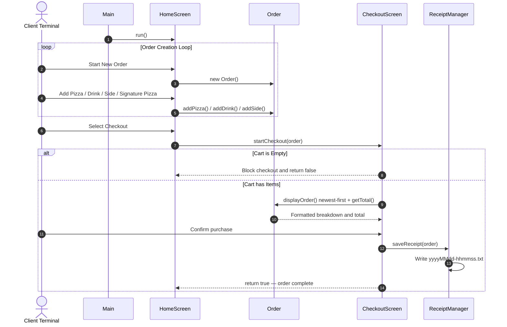

# Deenie's Pizzeria
### A terminal-based pizza ordering system built in Java with customizable orders, receipt generation, and structured checkout flow.
[](#)
[](#)
[](#)
[](#)

---

## 🗺️ System Overview

### Project Description
PIZZA-licious is a Java-based command-line ordering system for a pizza shop. It allows users to build fully custom order items, select pre-configured signature pizzas, add drinks and sides, and complete checkout with an automatically generated receipt file.

The system replaces manual order tracking with an organized digital ordering system that helps keep pricing accurate and orders consistent.

### Problem Solved & Target User
This application replaces a manual paper-based ordering process that was prone to calculation mistakes and missing records. It ensures:

- Accurate order totals through automatic price calculation
- Organized order tracking with newest items displayed first
- A saved timestamped receipt file for every completed transaction

The target user is a cashier taking customer orders at a pizza shop terminal.

---

## ⚡ Features

### 🍕 Order Management
- **Step-by-Step Customization:** Build fully custom order items with type selection, size, premium meats, premium cheeses, regular toppings, and special options
- **Topping Quantity Multipliers:** Prompts for a specific topping count then loops input prompts to match the exact quantity
- **Flexible Cart:** Add unlimited pizzas, drinks, and sides to the same order
- **Newest-First Display:** Order summary always shows the most recently added item at the top

### 🌟 Signature Pizzas *(Bonus — Inheritance)*
- **Signature Margherita:** 12" Regular — Mozzarella, Tomatoes, Basil, Toasted
- **Signature Veggie:** 8" Regular — Bell Peppers, Spinach, Olives, Mozzarella
- **Editing After Selection:** Add or remove meats, cheeses, and regular toppings after selecting a signature template

### 💰 Pricing System
- **Size-Based Scaling:** Pizza base costs adjust automatically across 8", 12", and 16" options
- **Premium Ingredient Pricing:** Premium meats and cheeses calculate extra fees based on the size tier
- **Special Options:** Toasted, stuffed crust, and deep fried add a flat $2.00 surcharge
- **Standard Products:** Drinks use size-based pricing ($2.00 / $2.50 / $3.00), sides use flat $1.50 pricing

### 🛡️ Validation & Checkout Rules
- **Crash-Proof Input:** All scanner reads wrapped in `InputMismatchException` loops — letters and symbols re-prompt, never terminate the app
- **Size Validation:** Pizza and drink sizes only accept approved values
- **Empty Cart Guard:** Checkout blocked if no pizzas, drinks, or sides have been added
- **Non-Blank Name Guards:** Drink names, side names, and item selections cannot be submitted blank

### 🧾 Receipt System
- **Automatic Receipt Generation:** Every completed checkout creates a timestamped `.txt` receipt
- **Saving Every Item Detail:** Every meat, cheese, topping, and special option written individually per pizza
- **Unique Timestamp Files:** Records saved as `yyyyMMdd-hhmmss.txt` to prevent file overwrites

---

## 🛠️ Tech Stack

| Component | Technology | Purpose |
|:---|:---|:---|
| Language Runtime | Java SE 17+ | Core Java runtime |
| Console I/O | `java.util.Scanner` | Console input handling |
| Validation | `InputMismatchException` | Prevents invalid numeric input |
| Collections | `java.util.ArrayList` | Dynamic topping and order item storage |
| File Output | `java.io.BufferedWriter`, `FileWriter` | Plain-text receipt file output |
| Temporal Engine | `java.time.LocalDateTime` | Timestamp-based receipt naming |
| Development | IntelliJ IDEA, Git, GitHub | Development and version control |

---

## 📐 Architecture & Design

### Class Responsibilities

| Class | Role |
|:---|:---|
| `Main` | Program entry point — starts `HomeScreen` and calls `run()` |
| `HomeScreen` | Menus, scanner input, validation loops, and item creation |
| `CheckoutScreen` | Order review, empty-cart guard, purchase confirmation, sends receipt saving to `ReceiptManager` |
| `MenuItem` | Abstract parent class — defines `getName()` and forces subclasses to implement `calculatePrice()` |
| `Order` | Shared `ArrayList<MenuItem>` — newest-first display and helper methods |
| `Pizza` | Size/type/special-option model — premium meats, cheeses, regular toppings, and pricing |
| `SignaturePizza` | Extends `Pizza` — `margherita()` and `veggie()` factory methods pre-load ingredients |
| `Drink` | Size-string to price mapping — small / medium / large |
| `Side` | Flat $1.50 side item |
| `ReceiptManager` | Writes fully itemized `.txt` receipt files |

---

### Data Flow Diagram



---

## 📂 Project Structure

```text
pizza-shop/
│
├── src/
│   └── main/
│       └── java/
│           └── com/
│               └── pluralsight/
│                   ├── data/
│                   │   └── ReceiptManager.java
│                   │
│                   ├── models/
│                   │   ├── MenuItem.java
│                   │   ├── Order.java
│                   │   ├── Pizza.java
│                   │   ├── SignaturePizza.java
│                   │   ├── Drink.java
│                   │   └── Side.java
│                   │
│                   └── ui/
│                       ├── Main.java
│                       ├── HomeScreen.java
│                       └── CheckoutScreen.java
│
└── README.md
```

---

## 🚀 How to Run

### Prerequisites

Verify Java is installed:

```bash
java -version
```

Requires JDK 17 or higher.

### Steps to Execute

**1. Clone the repository**

```bash
git clone <your-repo-url>
cd pizza-shop
```

**2. Compile all source files**

```bash
javac src/main/java/com/pluralsight/**/*.java -d out
```

**3. Launch the application**

```bash
java -cp out com.pluralsight.ui.Main
```

---

## 🧠 Object-Oriented Programming Concepts

### 1. Encapsulation

All data fields inside objects are `private` or `protected`. Outside code never modifies internal collections directly — it uses helper methods instead:

```java
// Pizza.java
private ArrayList<String> meats;

public void addMeat(String meat)
{
    if (!meat.isEmpty()) meats.add(meat);
}
```

### 2. Inheritance

Shared behavior is defined once in the parent class to avoid repeating code. `Pizza`, `Drink`, and `Side` all extend `MenuItem`. `SignaturePizza` extends `Pizza` so it can reuse pizza behavior while adding pre-loaded ingredient templates:

```java
public class SignaturePizza extends Pizza
{
    public static SignaturePizza margherita()
    {
        SignaturePizza pizza = new SignaturePizza("Signature Margherita", "12", "regular");
        pizza.addCheese("Mozzarella");
        pizza.addRegularTopping("Tomatoes");
        pizza.addRegularTopping("Basil");
        pizza.setSpecialOption("toasted");
        return pizza;
    }
}
```

### 3. Polymorphism

The `Order` class stores every item under one shared type:

```java
private ArrayList<MenuItem> items;
```

When calculating the total, one loop calls `calculatePrice()` on every item. Java automatically calls the correct method for `Pizza`, `Drink`, or `Side` at runtime:

```java
public double getTotal()
{
    double total = 0;

    for (MenuItem item : items)
    {
        total += item.calculatePrice();
    }

    return total;
}
```

### 4. Abstraction

`MenuItem` is abstract. A generic menu item cannot exist on its own or have a default price, so every subclass must define its own pricing logic:

```java
public abstract class MenuItem
{
    public abstract double calculatePrice();
}
```

---

## 📋 Example Console & Receipt Output

**Terminal checkout display**

```text
=== CHECKOUT SCREEN ===
=== ORDER DETAILS ===

Custom Order Item Details:
- Size: 16"
- Type (bread/crust/shell/custom): thin crust
- Special Option (toasted/stuffed crust/deep fried): stuffed crust
- Premium Meats: [pepperoni]
- Premium Cheeses: [mozzarella]
- Regular Toppings: [mushrooms, olives]
  Item Price: $23.75

large cola - $3.00
Garlic Knots - $1.50

Total: $28.25

1) Confirm and Place Order
0) Cancel and Go Back to Menu
Choose an option: 1

Receipt saved to: 20260527-024512.txt
Thank you! Order processed successfully.
```

**Resulting receipt file (`20260527-024512.txt`)**

```text
=============================
       FOOD SHOP RECEIPT
=============================
Date: May 27, 2026  02:45:12 AM

--- ITEMS ---

  Custom Order Item (16" [thin crust])
    Special Option: stuffed crust
    + Meat:    pepperoni
    + Cheese:  mozzarella
    + Regular Topping: mushrooms
    + Regular Topping: olives
    Price: $23.75

  large cola - $3.00
  Garlic Knots - $1.50

=============================
  TOTAL:  $28.25
=============================
```

---

## 💰 Pricing Reference

| Size | Base Price | Meat / ea | Cheese / ea | Special Option |
|:---|:---|:---|:---|:---|
| 8" Personal | $8.50 | +$1.00 | +$0.75 | +$2.00 |
| 12" Medium | $12.00 | +$2.00 | +$1.50 | +$2.00 |
| 16" Large | $16.50 | +$3.00 | +$2.25 | +$2.00 |

| Item | Small | Medium | Large |
|:---|:---|:---|:---|
| Drinks | $2.00 | $2.50 | $3.00 |
| Sides (any) | — | $1.50 flat | — |

Regular toppings are included free on any size pizza.

---

## 📄 License

This project is licensed under the [MIT License](LICENSE).

---
